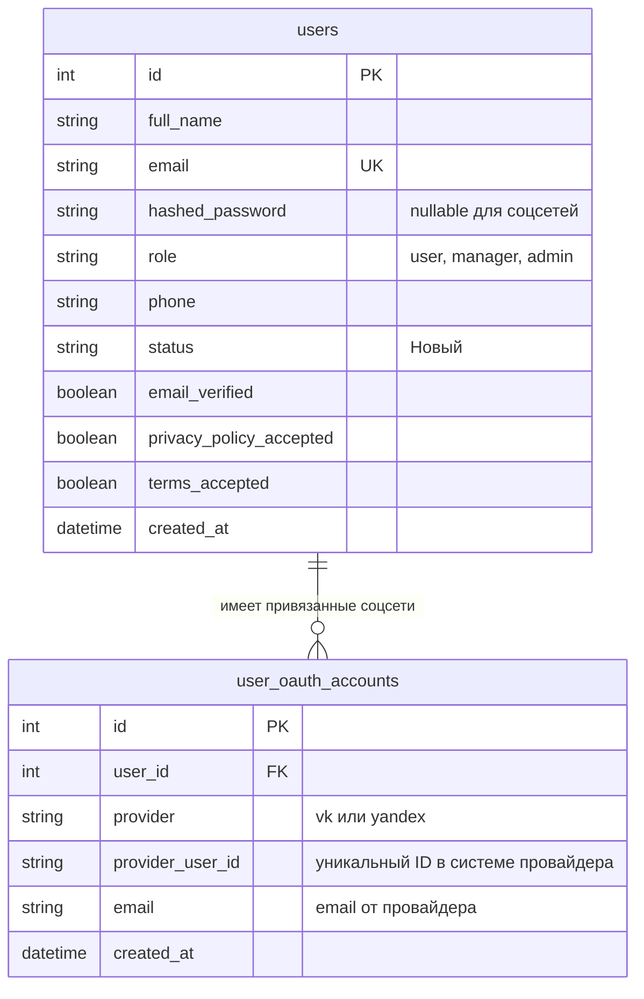
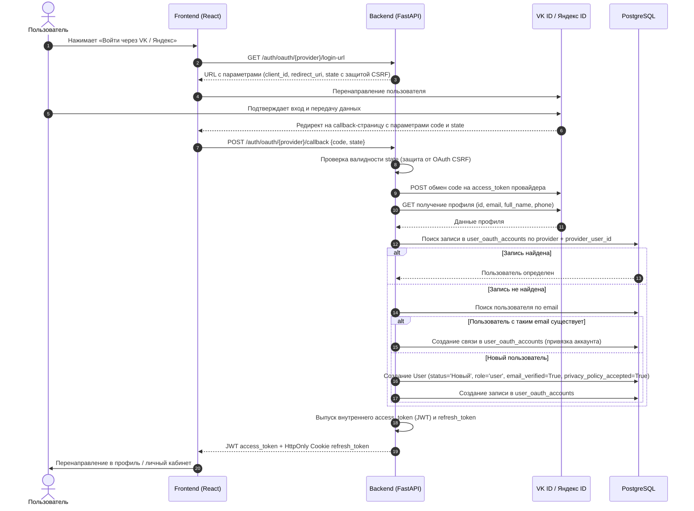

# Руководство: Интеграция авторизации и регистрации через VK ID и Яндекс ID

## 1. Юридический анализ: Соответствие законодательству РФ

### 1.1. Федеральный закон № 406-ФЗ (поправки к ст. 10.2-1 Федерального закона № 149-ФЗ)
С **1 декабря 2023 года** (с окончанием всех переходных периодов к 2025 году) на российских сайтах и интернет-сервисах, владельцами которых являются граждане РФ или российские организации, законодательно ограничен перечень способов авторизации пользователей, находящихся на территории РФ.

Законодательство устанавливает закрытый перечень из **4 разрешенных способов авторизации**:
1. **Номер телефона** российского оператора связи (+7);
2. **ЕСИА** (портал «Госуслуги»);
3. **Единая биометрическая система (ЕБС)**;
4. **Информационные системы**, владельцами которых являются граждане РФ (без второго гражданства) или российские юридические лица (с долей иностранного участия менее 50%).

> [!IMPORTANT]
> **VK ID** (ООО «В Контакте») и **Яндекс ID** (ООО «Яндекс») являются официальными российскими системами аутентификации, которые прямо подпадают под пункт 4 ст. 10.2-1 Федерального закона № 149-ФЗ.
>
> Использование VK ID и Яндекс ID **не только полностью законно**, но и является **наиболее рекомендуемым решением** для соответствия требованиям 406-ФЗ (в отличие от сервисов Google Sign-In или Apple ID, которые использовать для авторизации российских граждан на отечественных сайтах запрещено).

---

### 1.2. Федеральный закон № 152-ФЗ «О персональных данных» и закон № 242-ФЗ (локализация данных)

Проект **полностью подходит** для работы с VK ID и Яндекс ID без нарушения законодательства о персональных данных при выполнении следующих требований:

1. **Локализация баз данных (ч. 5 ст. 18 152-ФЗ):**
   - При сборе персональных данных граждан РФ их первичная запись, систематизация, накопление, хранение и извлечение должны производиться с использованием баз данных, находящихся на территории РФ.
   - **Состояние проекта:** Архитектура проекта построена на Docker-контейнерах (PostgreSQL + FastAPI + Vite/React). При размещении продакшн-сервера у любого российского хостинг-провайдера (Selectel, Timeweb Cloud, VK Cloud, Yandex Cloud, Beget и т.д.) требование о локализации полностью соблюдается.

2. **Согласие на обработку персональных данных (ст. 9 152-ФЗ):**
   - В момент авторизации через VK/Яндекс провайдер передает нашему сайту персональные данные (ФИО, email, телефон, аватар).
   - Для того чтобы сайт имел законное право обрабатывать эти данные, пользователь должен выразить согласие с Политикой конфиденциальности и Пользовательским соглашением.
   - **Состояние проекта:** В кодовой базе уже реализованы модальные окна `PrivacyPolicyModal.tsx` и `TermsOfServiceModal.tsx`, а в модели `User` присутствуют поля `privacy_policy_accepted` и `terms_accepted`.
   - **Что требуется сделать:** Непосредственно под кнопками входа «Войти через VK» / «Войти с Яндекс ID» разместить явную текстовую плашку со ссылками:
     > *«Нажимая кнопку входа через VK ID или Яндекс ID, вы принимаете условия Пользовательского соглашения и даете согласие на обработку персональных данных в соответствии с Политикой конфиденциальности»*.

3. **Принцип соразмерности и минимизации данных (ст. 5 152-ФЗ):**
   - Разрешено запрашивать у провайдеров только те данные, которые объективно необходимы для сервиса аренды оборудования:
     - `Имя и фамилия` (для идентификации клиента и составления договора);
     - `Email` (для отправки чеков, подтверждений броней и смены пароля);
     - `Номер телефона` (для оперативной связи по аренде);
     - `Аватар` (опционально, для отображения в профиле).
   - **Запрещено** запрашивать избыточные скоупы (список друзей, переписки, аудиозаписи и т.п.).

4. **Актуализация локальных документов (в `PrivacyPolicyModal.tsx`):**
   - Дополнить перечень обрабатываемых данных идентификаторами учетных записей (`VK ID`, `Yandex ID`);
   - Указать ООО «В Контакте» и ООО «Яндекс» как лиц, привлекаемых оператором для авторизации (или передающих данные с согласия пользователя).

5. **Регистрация в Роскомнадзоре (ст. 22 152-ФЗ):**
   - Поскольку с 1 сентября 2022 года почти все исключения отменены, оператор (ИП Садомцев А.Ю.) должен подать/актуализировать уведомление об обработке персональных данных через портал РКН (`pd.rkn.gov.ru`).

---

## 2. Что нужно зарегистрировать и настроить у провайдеров

### 2.1. Яндекс ID (Яндекс OAuth)

#### Пошаговые действия:
1. Авторизоваться в рабочем аккаунте Яндекса и перейти в консоль разработчика: [oauth.yandex.ru](https://oauth.yandex.ru/).
2. Нажать кнопку **«Создать приложение»**.
3. Заполнить форму регистрации приложения:
   - **Название сервиса:** Отображается пользователю в окне подтверждения входа (например, «Аренда фототехники»);
   - **Иконка:** Логотип компании (квадратный PNG, минимум 192x192 px);
   - **Ссылка на сайт:** Адрес сайта сервиса;
   - **Ссылка на политику конфиденциальности:** URL страницы политики на сайте.
4. Выбрать платформу: **Веб-сервисы**.
5. Указать **Redirect URI** (разрешенные адреса перенаправления):
   - Боевой: `https://yourdomain.ru/oauth/callback/yandex` (или API endpoint `https://yourdomain.ru/api/auth/oauth/yandex/callback`);
   - Локальный (для разработки): `http://localhost:5173/oauth/callback/yandex` (или `http://localhost:8000/api/auth/oauth/yandex/callback`).
6. В разделе **«Яндекс ID»** отметить запрашиваемые доступы (Scopes):
   - `login:email` — доступ к адресу электронной почты;
   - `login:info` — доступ к имени, фамилии и полу;
   - `login:avatar` — доступ к аватару;
   - `login:phone` — доступ к номеру телефона (при необходимости).
7. Сохранить приложение и скопировать:
   - **Client ID** (Идентификатор приложения);
   - **Client Secret** (Пароль приложения).

---

### 2.2. VK ID (ВКонтакте)

#### Пошаговые действия:
1. Перейти в кабинет разработчика VK ID: [id.vk.com/business/go](https://id.vk.com/business/go) (или [dev.vk.com](https://dev.vk.com/)).
2. Создать приложение типа **«Сайт»**.
3. Заполнить карточку приложения:
   - Название сайта/сервиса;
   - Основной домен сайта (например, `yourdomain.ru` и `localhost:5173` для разработки);
   - Доверенный Redirect URL (например, `https://yourdomain.ru/oauth/callback/vk`).
4. Настроить скоупы (Scopes):
   - `email` — получение подтвержденного адреса почты;
   - `phone` — получение номера телефона (требует подтверждения модерацией VK для боевого режима);
   - Базовый профиль (имя, фамилия, аватар).
5. Получить в настройках приложения:
   - **App ID** (Client ID);
   - **Защищенный ключ** (Client Secret).
6. Выбрать метод интеграции:
   - **Вариант 1 (Рекомендуется для React):** Официальный `@vkid/sdk` — предоставляет готовый виджет One Tap или всплывающее брендовое окно авторизации с передачей авторизационного кода на бэкенд.
   - **Вариант 2 (Классический OAuth 2.1 / PKCE Code Flow):** Редирект пользователя на страницу авторизации VK и обработка callback на бэкенде.

---

## 3. Архитектура интеграции в проект

### 3.1. Структура базы данных

Для надежной поддержки нескольких провайдеров и сохранения возможности входа по паролю рекомендуется создать отдельную таблицу `user_oauth_accounts`. Это позволит одному пользователю привязать к своему профилю и VK, и Яндекс.



#### Новая модель SQLAlchemy (`RentalApp_FASTAPI/api/models/user_oauth_account.py`):
```python
from sqlalchemy import Column, Integer, String, DateTime, ForeignKey, UniqueConstraint
from sqlalchemy.orm import relationship
from datetime import datetime, timezone
from api.database_models import Base

class UserOAuthAccount(Base):
    __tablename__ = "user_oauth_accounts"

    id = Column(Integer, primary_key=True)
    user_id = Column(Integer, ForeignKey("users.id", ondelete="CASCADE"), nullable=False)
    provider = Column(String(32), nullable=False)  # 'vk' или 'yandex'
    provider_user_id = Column(String(255), nullable=False, index=True)
    email = Column(String(255), nullable=True)
    created_at = Column(DateTime(timezone=True), default=lambda: datetime.now(timezone.utc))

    user = relationship("User", back_populates="oauth_accounts")

    __table_args__ = (
        UniqueConstraint("provider", "provider_user_id", name="uq_provider_user_id"),
    )
```

В модели `User` (`RentalApp_FASTAPI/api/models/user.py`) добавляется связь:
```python
oauth_accounts = relationship("UserOAuthAccount", back_populates="user", cascade="all, delete-orphan")
```

---

### 3.2. Алгоритм аутентификации и регистрации



---

## 4. Последовательный план внедрения

### Этап 1: Подготовительный (Регистрация и переменные окружения)
- [ ] Зарегистрировать веб-приложение в [oauth.yandex.ru](https://oauth.yandex.ru/).
- [ ] Зарегистрировать веб-приложение в [id.vk.com](https://id.vk.com/).
- [ ] Добавить в конфигурацию бэкенда (`RentalApp_FASTAPI/config/core.py`) и `.env`:
  ```ini
  YANDEX_CLIENT_ID=...
  YANDEX_CLIENT_SECRET=...
  YANDEX_REDIRECT_URI=https://yourdomain.ru/oauth/callback/yandex

  VK_CLIENT_ID=...
  VK_CLIENT_SECRET=...
  VK_REDIRECT_URI=https://yourdomain.ru/oauth/callback/vk
  ```

### Этап 2: Бэкенд (FastAPI + SQLAlchemy)
- [ ] **Модель и миграция:**
  - Создать `RentalApp_FASTAPI/api/models/user_oauth_account.py`.
  - Добавить `oauth_accounts` в `api/models/user.py`.
  - Сгенерировать и применить миграцию Alembic (`alembic revision --autogenerate -m "add_oauth_accounts"`).
- [ ] **OAuth-клиент (`api/services/oauth_service.py`):**
  - Реализовать генерацию ссылок авторизации с подписанным `state` (используя `URLSafeTimedSerializer`).
  - Реализовать обмен `code` на токен и вызов API профиля для Яндекс ID (`https://login.yandex.ru/info`).
  - Реализовать обмен `code` на токен и вызов API профиля для VK ID (`https://api.vk.com/method/users.get` или VK ID OAuth 2.1).
  - Реализовать логику авторегистрации нового пользователя или привязки к существующему.
- [ ] **API эндпоинты в `api/auth_api.py`:**
  - `GET /auth/oauth/{provider}/login-url`
  - `POST /auth/oauth/{provider}/callback`
- [ ] **Аудит безопасности:**
  - Логирование входов через `SecurityAuditService`.

### Этап 3: Фронтенд (React + Vite + Tailwind)
- [ ] **Кнопки входа в `AuthForm.tsx`:**
  - Добавить блок быстрых способов входа («Войти через Яндекс ID», «Войти через VK ID») с официальными логотипами и цветами.
  - Разместить сноску с согласием на обработку персональных данных.
- [ ] **Страница Callback (`OAuthCallbackPage.tsx`):**
  - Обработка возврата от провайдера, отправка `code` и `state` на бэкенд.
  - Отображение спиннера загрузки и обработка ошибок (если пользователь отменил вход).
  - Запись полученного токена в Zustand store (`useAuthStore`) и редирект пользователя в приложение.

### Этап 4: Юридические правки и документация
- [ ] Дополнить текст в `PrivacyPolicyModal.tsx` указанием идентификаторов профилей соцсетей и операторов VK / Яндекс.
- [ ] Проверить/подать уведомление об обработке ПДн в реестр Роскомнадзора.

### Этап 5: Тестирование и развертывание
- [ ] Покрыть юнит-тестами методы `OAuthService` (с моками внешних HTTP-запросов).
- [ ] Проверить сквозной сценарий регистрации и входа в тестовом контуре Docker.
- [ ] Развернуть на боевом сервере с обновленными секретами в `.env`.
